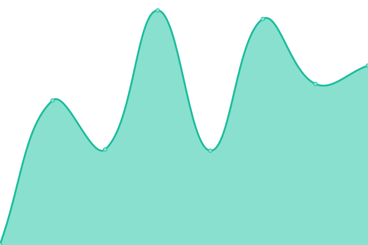
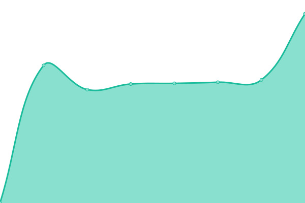

# [📈 Live Status](https://klitsche.github.io/upptime): <!--live status--> **🟧 Partial outage**

This repository contains the open-source uptime monitor and status page for [klitsche.de](https://klitsche.de), powered by [Upptime](https://github.com/upptime/upptime).

With [Upptime](https://upptime.js.org), you can get your own unlimited and free uptime monitor and status page, powered entirely by a GitHub repository. We use [Issues](https://github.com/klitsche/upptime/issues) as incident reports, [Actions](https://github.com/klitsche/upptime/actions) as uptime monitors, and [Pages](https://klitsche.github.io/upptime) for the status page.

<!--start: status pages-->
<!-- This summary is generated by Upptime (https://github.com/upptime/upptime) -->
<!-- Do not edit this manually, your changes will be overwritten -->
<!-- prettier-ignore -->
| URL | Status | History | Response Time | Uptime |
| --- | ------ | ------- | ------------- | ------ |
|  [klitsche.de](https://klitsche.de) | 🟩 Up | [klitsche-de.yml](https://github.com/klitsche/upptime/commits/HEAD/history/klitsche-de.yml) | 

 715ms
     
 | 

<a href="https://klitsche.github.io/upptime/history/klitsche-de">100.00%</a>
    

|  [wurfscheibe.de](https://wurfscheibe.de) | 🟩 Up | [wurfscheibe-de.yml](https://github.com/klitsche/upptime/commits/HEAD/history/wurfscheibe-de.yml) | 

 644ms
     
 | 

<a href="https://klitsche.github.io/upptime/history/wurfscheibe-de">100.00%</a>
    

|  [dataloo.de](https://dataloo.de) | 🟩 Up | [dataloo-de.yml](https://github.com/klitsche/upptime/commits/HEAD/history/dataloo-de.yml) | 

 807ms
     
 | 

<a href="https://klitsche.github.io/upptime/history/dataloo-de">100.00%</a>
    

|  [tschk.de](https://tschk.de) | 🟩 Up | [tschk-de.yml](https://github.com/klitsche/upptime/commits/HEAD/history/tschk-de.yml) | 

 765ms
     
 | 

<a href="https://klitsche.github.io/upptime/history/tschk-de">100.00%</a>
    

|  [derkundschafter.de](https://derkundschafter.de) | 🟥 Down | [derkundschafter-de.yml](https://github.com/klitsche/upptime/commits/HEAD/history/derkundschafter-de.yml) | 

 8385ms
     
 | 

<a href="https://klitsche.github.io/upptime/history/derkundschafter-de">99.54%</a>
    

|  [gleistein.com](https://www.gleistein.com) | 🟩 Up | [gleistein-com.yml](https://github.com/klitsche/upptime/commits/HEAD/history/gleistein-com.yml) | 

 909ms
     
 | 

<a href="https://klitsche.github.io/upptime/history/gleistein-com">100.00%</a>
    

|  [relaunch.gleistein.com](https://relaunch.gleistein.com) | 🟩 Up | [relaunch-gleistein-com.yml](https://github.com/klitsche/upptime/commits/HEAD/history/relaunch-gleistein-com.yml) | 

 989ms
     
 | 

<a href="https://klitsche.github.io/upptime/history/relaunch-gleistein-com">100.00%</a>
    

<!--end: status pages-->

[**Visit our status website →**](https://klitsche.github.io/upptime)

## 📄 License

- Powered by: [Upptime](https://github.com/upptime/upptime)
- Code: [MIT](./LICENSE) © [klitsche.de](https://klitsche.de)
- Data in the `./history` directory: [Open Database License](https://opendatacommons.org/licenses/odbl/1-0/)
